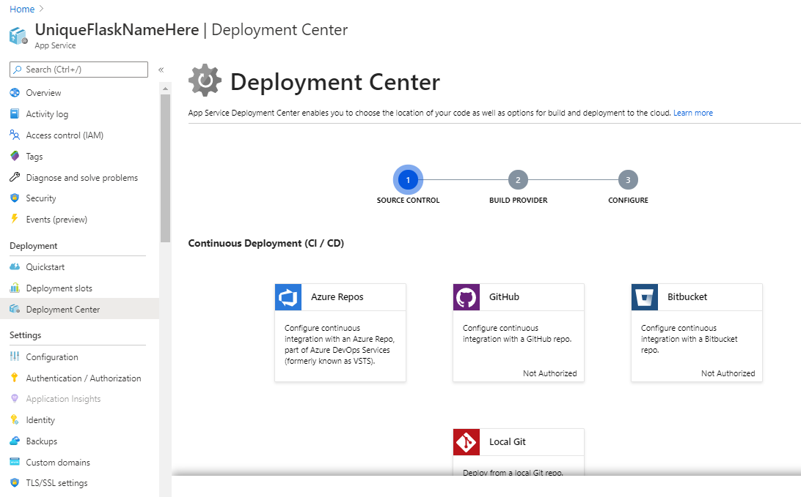

## Flask Notes

### Making a Directory

First make a new folder, in order to manage this new Flask project that we will create.

For the purposes of this demo, we will name the folder `flask_app`

### Setting up a Virtual Environment

#### Linux / Ubuntu

Sometimes in a Ubuntu Linux system, the standard venv package is not installed by default. To add it to your system, install the python3-venv package as follows: 

`$ sudo apt-get install python3-venv`

The command that creates a virtual environment has the following structure: 

`python3 -m venv venv`

To activate

`source venv/bin/activate`

#### Windows

The command that creates a virtual environment has the following structure: 

`python3 -m venv venv`

To activate a virtual environment, in the current project directory, type in the following:

`venv\Scripts\activate`

If you don't want to set up the virtual environment.

```deactivate```

### Installing Flask

```
(env) $ pip install flask
```

```
(venv) pip freeze
click==7.1.2
Flask==1.1.2
itsdangerous==1.1.0
Jinja2==2.11.2
MarkupSafe==1.1.1
Werkzeug==1.0.1
```

#### Basic Application Structure

Create a new file in the folder you created and call it app.py

```python
from flask import flask
app = Flask(__name__)

@app.route('/')
@app.route('/index')
def index():
    return "Hello, World!"
```

### Development Web Server

Now that we have created our first web server, we will need a way to run it locally. This allows us to develop and test it without having the need to have it hosted.

#### MacOS/Linux

```
(venv) $ export FLASK_APP=app.py
(venv) $ flask run
 * Serving Flask app "hello"
 * Running on http://127.0.0.1:5000/ (Press CTRL+C to quit)
```

#### Windows

For users using bash, please input the following line:

```bash
export FLASK_APP=app.py
```

For users using PowerShell, please input the following line:

```powershell
Set-Item Env:FLASK_APP ".\app.py"
```

```
(venv) $ set FLASK_APP=app.py
(venv) $ flask run
 * Serving Flask app "hello"
 * Running on http://127.0.0.1:5000/ (Press CTRL+C to quit)
```

### Configure Azure Web App Service for Deployment

Now we would like to host our application on the internet. 

Azure has a great way to do this with its Azure App Service. 

We will need to configure this via the Azure Portal. https://portal.azure.com/

After logging in, we want to click on the plus icon and "create a resource".


Select "Web App". This will be the service we will use to deploy our application.


#### Resource Group

For our new application, we will need to create a resource group. A **resource group** is a logical container into which Azure resources like web apps, databases, and storage accounts are deployed and managed. We should generally have our names be meaningful and easily distinguishable, but for our demo purposes we will name it flask_app.


Make sure you select the APP Service Plan as F1 as we will use it for testing and development purposes. 
F1 is a free tier that will not incur charges to our account. This step is very important.

After we have confirmed the settings, click on the blue button "Review + Create". 

A deployment will be underway and we'll have a service ready to host our flask application.
Once it is complete, you will see:


### Deployment

Our intention is to deploy our application code from a github repository to run on our newly created Azure App Service.

Alternatively we can deploy from local git and we'll have more details about that soon.

Now, let's click on "go to resource" to see our new App Service. 
Another way to navigate it is to click on the hamburger icon on the top right corner and then select "All resources" and then select our newly created resource.



Now we want to select deployment center. Under the Continuous Deployment (CI/CD), we want to select the GitHub option.

Select "Github > App Service build service". 
Then continue and select your git hub username to continue.

Select the repository that we have created earlier and then select the master branch.
Click continue and select finish. The deployment should take a few minutes and will notify you when it is complete.

Congratulations, you have now successfully deployed your first flask application!

