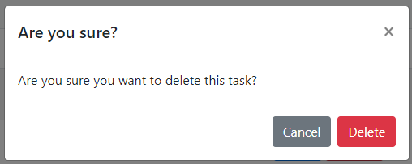

# Flask Part 2 -  Managing Data with Databases

## Learning Outcomes

* Create requests on our webpages to delete tasks using the Fetch
* Create and use a JavaScript function to complete the DELETE request
* How to handle DELETE methods in Flask

### Deleting Tasks

You've made it all the way here though to this section. Great work!
You'll now learn another important part of managing data which is deleting items. 

### Update the Delete Button

First of all, let's modify the delete button in `index.html` to support the deletion of a task.

```html
<!--- REPLACE ME (LINE 46) --->
<button type="button" class="btn btn-danger">
    Delete
</button>

<!--- WITH THIS --->
<!-- Button trigger modal -->
<button
  type="button"
  data-item-id="{{task.id}}"
  data-toggle="modal"
  data-target="#deleteModal"
  class="btn btn-danger"
  onclick="{setDeleteId(this)}"
>
  Delete
</button>

```

Notice that we've added a few more attributes to the button HTML element. These properties include *data-item-id*, *data-toggle*, *data-target*, and *onClick*. We have explained *data-target* and *data-toggle* earlier, if you need to refresh your knowledge. Please refer to Adding a Task (Link here).  Setting`data-toggle="modal"`, allows us to set up a modal which targets `data-target="#deleteModal"` which will be a pop up modal that we will create shortly.

In HTML 5, we have a way to store additional information in an HTML element. We can do this with data-attributes. The way we define them is with `data-<our data name here>`, where we replace the spaces with additional dashes `-`s. For example, `data-example-item`.

We do this to attach the id, which is the unique identifier of the task in the element, that way when we delete it, we will know which task we will be referring to and will be able to send this back to our Flask server.

For more information on data attributes:

https://developer.mozilla.org/en-US/docs/Learn/HTML/Howto/Use_data_attributes

### Creating the Delete Task Modal

Often for delete buttons, there is a confirmation window to make sure the user wanted to delete. Ocassionally, we may misclick and delete something we don't intend to. So let us create a confirmation pop up window to prevent this from happening. 

This is what it will look like:



We will append this after the first modal `<div>` or above the first `<script>` tag.

`index.html`

```html
</div>

<!-- INSERT ME HERE! Line (106) -->

<!-- Javascript support for bootstrap -->
    <script
        src="https://code.jquery.com/jquery-3.4.1.slim.min.js"
        integrity="sha384-J6qa4849blE2+poT4WnyKhv5vZF5SrPo0iEjwBvKU7imGFAV0wwj1yYfoRSJoZ+n"
        crossorigin="anonymous"
    ></script>
```

Lets put the code below in index.html.

```html
<!-- Modal for Deleting a Task -->
<div
  class="modal fade"
  id="deleteModal"
  tabindex="-1"
  role="dialog"
  aria-labelledby="exampleModalLabel"
  aria-hidden="true"
>
  <div class="modal-dialog">
    <div class="modal-content">
      <div class="modal-header">
        <h5 class="modal-title" id="deleteModalLabel">Modal title</h5>
        <button
          type="button"
          class="close"
          data-dismiss="modal"
          aria-label="Close"
        >
          <span aria-hidden="true">&times;</span>
        </button>
      </div>
      <div class="modal-body">
        Are you sure you want to delete this task?
      </div>
      <div class="modal-footer">
        <button type="button" class="btn btn-secondary" data-dismiss="modal">
          Cancel
        </button>
        <button
          type="button"
          class="btn btn-danger"
          onClick="deleteTask(deleteId)"
        >
          Delete
        </button>
      </div>
    </div>
  </div>
</div>
```

Now, when we click the delete task on an item row, a confirmation window will pop up asking if the user is sure that they want to delete the task. If they are sure, they will need to click the delete button.

```html
<button
  type="button"
  class="btn btn-danger"
  onClick="deleteTask(deleteId)"
>
```

Clicking on that delete button will call a function called `deleteTask()` which we will define in the next section.

#### Using JavaScript functions and Fetch to Delete the Item

Below the three JavaScript `<script>` tags, we will add the following:

```html
<script>
  var deleteId = 0;
  function setDeleteId(event) {
    deleteId = event.dataset.itemId;
  }
  function deleteTask(id) {
    fetch("/item/" + id, {
      method: "DELETE",
    })
      .then(() => window.location.reload())
      .catch((error) => console.log("Something went wrong: " + error));
  }
</script>

```

In the first line, we declared a variable called deleteId. This is updated with `setDeleteId(event)` function. This is a callback that is called when we click on the delete button. The parameter being passed through is an object with information about the event that has just occurred such as what element was pressed, what type of event as well as lots of other information. Here, we are interested in the data attributes, which we can access via the "data-set" property which is a map that we can use to access any data variables we have assigned to the HTML element earlier. 

The function deleteTask is called when the confirmation popup to delete the task appears and the user clicks on the modal. When the user confirms `deleteTask(id)` is called, what it does is send a request to our server saying to delete the task. Once it completes successfully, the `.then()` clause runs and reloads our page with `window.location.reload()`.

For more information about events and onClick handling:

https://developer.mozilla.org/en-US/docs/Web/API/Event

https://developer.mozilla.org/en-US/docs/Web/API/GlobalEventHandlers/onclick

For more about Promises (then, catch):

https://developer.mozilla.org/en-US/docs/Web/JavaScript/Guide/Using_promises

#### Handling the Delete Request on our Flask Server

Now we've done all we need from the user perspective with our web page by making appropriate changes. However, currently our server does not know what to do to handle it. We will add the following to our `routes.py`

```python
# DELETE (Delete a specific task id)
@app.route('/task/<int:id>', methods=['DELETE'])
def delete_task(id):
    task = Task.query.filter_by(id=id).first()
    
    # Check if Task exists
    if (task != None):
        msg = {
            'message': 'Delete successful'
        }
        db.session.delete(task)
        db.session.commit()
        return jsonify(msg), 200
	
    # Task does not exist
    msg = {
        'message': 'Task not found'
    }
    return jsonify(msg), 204
```

The function `delete_task(id)` takes in a parameter from the url, and finds the task from the database. If the id we receive is valid and the task exists in the database, that is given to us in ` task = Task.query.filter_by(id=id).first()`, we will delete it and commit in the database.