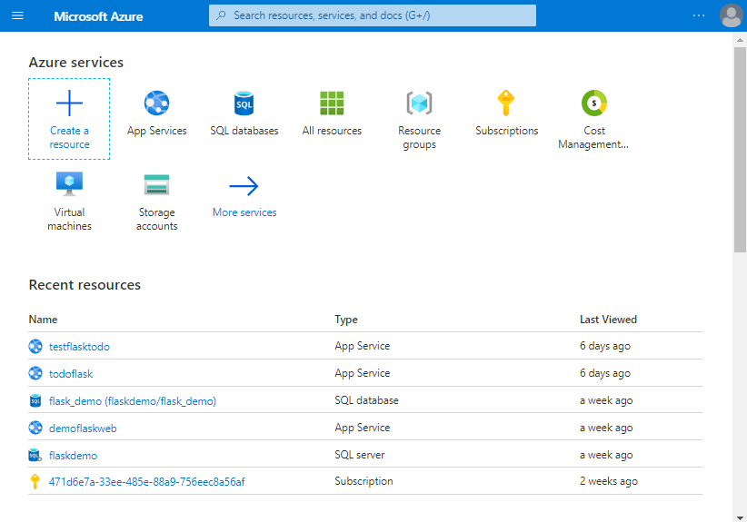
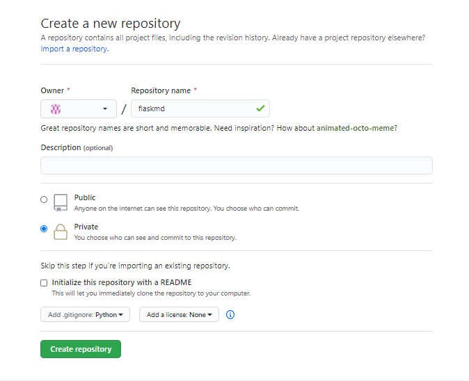
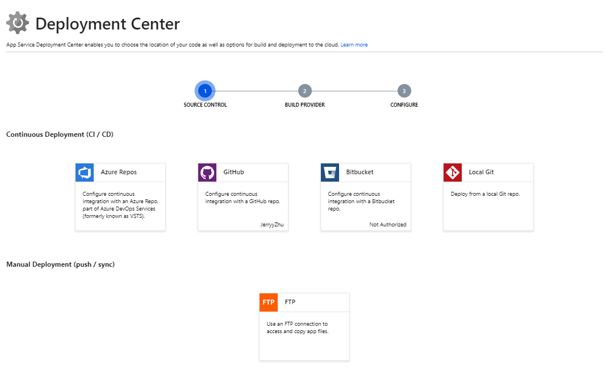
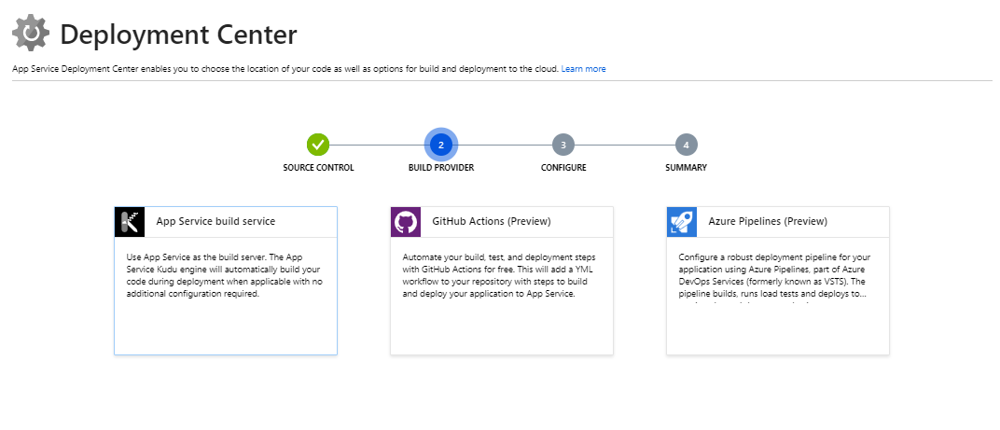
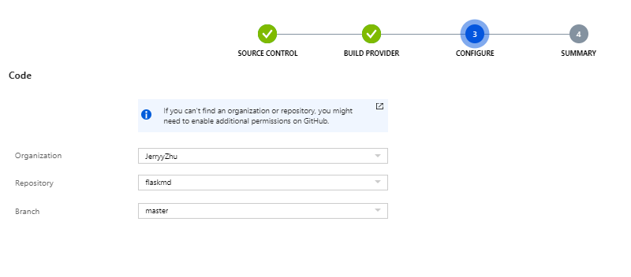

# Flask Part 5 -  Managing Data with Databases

## Learning Outcomes

* Learn to create resources in Azure Portal
* Use continuous deployment with GitHub and Azure Deployment Center
* Deploy and manage a Flask Application and Azure SQL Service
* Use application settings / environment variables to manage connection strings

## Setting Up Services

From the Azure portal, let's select create a new resource.



Next we select Web App.


For App Service Plan, if you don't currently have one, be sure to select the F1 tier which is free.

Click on review + create. Your deployment should be underway


### Creating a Azure SQL Database Service

Select SQL Database. 


Select the same resource group you have made for the earlier web app service.


For Project Details:

Select the Azure for Students subscription group.

For the resource group, we are creating a new resource group. You can give it any name you would like, for this guide I will use flaskmd, feel free to use this or another name.

For Database Details

Database Name: flask_todo

Server: Select "Create new"


The server name will need to be a unique instance to identify your database.
For Server Admin Login, put a username of your choice followed by a password. It is very important to remember these details as you will need them to access your database later on.

#### VERY IMPORTANT

For Computer + Storage, to minimise the costs of our student Azure account, we are going to select


To reduce the costs, we will the select General Purpose database.


Here, we are going with the bare minimum settings, 

Here, let's run the basic configuration for a database. This should be sufficient for our needs.

Then, hit "Next: Networking".


Click next, and for the networking tab:

Connectivity method: Public endpoint

Firewall rules:

Allow Azure services and resources to access this server: Tick yes

Add current client ip address: Tick yes

Click review and create, followed by create. Your database service should then be spinning up.

### Creating a GitHub Repo

#### Create an GitHub Account

If you don't have a GitHub account, you can register here: https://github.com/join


#### Install Git

Once you have a GitHub account, make sure you have git installed on your computer.

* Windows https://www.atlassian.com/git/tutorials/install-git#windows
* Mac OS X https://www.atlassian.com/git/tutorials/install-git#mac-os-x
* Linux https://www.atlassian.com/git/tutorials/install-git#linux

#### Initializing the GitHub Repo

After completing the steps above, we will need to create a new GitHub repo. [Explanation of github repo here]



Make sure to select a git ignore file with python as the option.

After we have created a brand new repository, we will need to get our github url.


Let's copy this url the navigate to our terminal in VS Code with our Flask project.

```
# Creates a new github repository
git init 

git remote add origin <YOUR GITHUB REPO URL>

# Add all current working files to the repository
git add .

git commit -m "Your commit message"

git push
```


#### Connecting our application with Azure SQL Database

We will need to make change our Flask configuration to support Azure SQL Database. 

First, we need to install pyobdc. 

pyodbc is an open source Python module that makes accessing ODBC databases simple

```
pip install pyodbc
```

Navigate back to the SQL Server resource

```
DRIVER={ODBC Driver 17 for SQL Server};SERVER=<Your SQL Service URL>;DATABASE=<Database Name>;UID=<YourAdminAccountName>;PWD=<YourPassword>
```

For illustrative purposes, the connection string below is what it may look like.

```
$env:dbstring="DRIVER={ODBC Driver 17 for SQL server};SERVER=flaskmd.database.windows.net;DATABASE=flask_todo;UID=flaskadmin;PWD=Password!"
```

##### Connection String in Environment Variables

For Linux, Mac, Linux Subsystem for Windows, Git Bash on Windows, etc.:

```bash
export dbstring="<DB STRING FROM ABOVE>"
```

For Windows CMD, use `set` instead of export:

```bash
set dbstring="<DB STRING FROM ABOVE>"
```

For PowerShell, use `$env`:

```powershell
$env:dbstring = "<DB STRING FROM ABOVE>"
```

Next we will need to modify our `__init__.py` file in order to use these details to connect to our Azure Database

```python
import os
import urllib.parse
from flask import Flask
from flask_sqlalchemy import SQLAlchemy

app = Flask(__name__)

db_string = os.environ['dbstring']
params = urllib.parse.quote_plus(db_string)

# initialization
app = Flask(__name__)
app.config['SECRET_KEY'] = 'supersecret'
app.config['SQLALCHEMY_DATABASE_URI'] = "mssql+pyodbc:///?odbc_connect=%s" % params
app.config['SQLALCHEMY_COMMIT_ON_TEARDOWN'] = True
app.config['SQLALCHEMY_TRACK_MODIFICATIONS'] = False

# basedir = os.path.abspath(os.path.dirname(__file__))

# app.config['SQLALCHEMY_DATABASE_URI'] =\
#     'sqlite:///' + os.path.join(basedir, 'data.sqlite')
# app.config['SQLALCHEMY_TRACK_MODIFICATIONS'] = False

db = SQLAlchemy(app)

from app import routes
```


#### Configure the database table on SQL Server

Since this is a brand new database, we will need to run our setup_db.py again

```bash
python setup_db.py
```

Afterwards, we will need to start up our server again to test if everything is fine.

```bash
(venv) flask run
 * Environment: production
   WARNING: This is a development server. Do not use it in a production deployment.
   Use a production WSGI server instead.
 * Debug mode: off
 * Running on http://127.0.0.1:5000/ (Press CTRL+C to quit)
127.0.0.1 - - [02/Aug/2020 16:29:21] "GET / HTTP/1.1" 200 -
```


Now let's run the following command in terminal

```
pip freeze > requirements.txt
```

This will generate a file similar to the one below. This is a list of modules or dependencies python needs to use in order make use of our application. The Azure application we will deploy will need this file in the next section.

```
click==7.1.2
Flask==1.1.2
Flask-SQLAlchemy==2.4.4
itsdangerous==1.1.0
Jinja2==2.11.2
MarkupSafe==1.1.1
pyodbc==4.0.30
SQLAlchemy==1.3.18
Werkzeug==1.0.1
```

Amazing! We've managed to read and write to an Azure SQL Database now. The next part will involve deploying this physical website to Azure since we now are managing the data on the cloud. 

#### Commit Our Changes to Repo

```
git add .
git commit -m "Added Azure SQL Connection!"
git push
```

### Deploying Our Website to Azure

Let's head back to the portal. 

Navigate to our newly created Web App Service. The one for this guide was called flasktodomd.


On the left, there are a number of options. Navigate to Deployment Center



Select GitHub, connect with your account if you have not done so before.

Here we will pick App Service Build Service.



Find the repo that we have recently created. For this guide, we used flaskmd, if you have named it something else than choose that.



After that, click finish. 

Congratulations. You have completed this tutorial!

You have now learnt to:

* Use HTML and Bootstrap to create a website
* Use Flask to serve static and dynamic content to users
* Manage data with Databases with SQLAlchemy and link that to Azure SQL Database services on Azure
* Use Platform as a Service to host your own Flask Web Application on Azure
