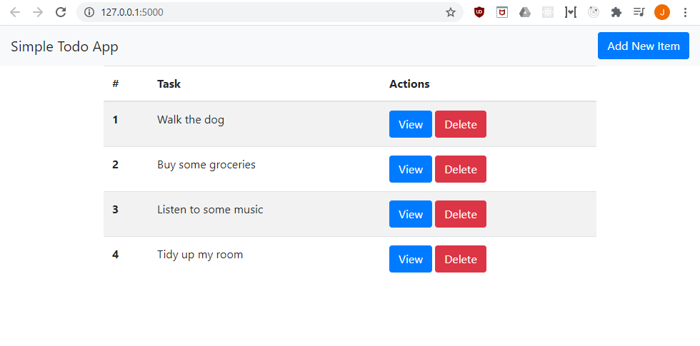

# Flask Tutorial

### Learning Outcomes


### Pre-requisites

#### Python 3

https://www.python.org/downloads/

#### Visual Studio Code

https://code.visualstudio.com/download

### Making a Directory

First of all, let's open up visual studio code, our code editor or an editor of your choice.

We will need to make a new folder, in order to manage our new Flask project.

For the purposes of this demo, we will name the folder `todo_flask`, now let's navigate inside it for the next step.

### Setting up a Virtual Environment

What is a virtual environment?

#### Linux / Ubuntu

Sometimes in a Ubuntu Linux system, the standard venv package is not installed by default. To add it to your system, install the python3-venv package as follows: 

`$ sudo apt-get install python3-venv`

The command that creates a virtual environment has the following structure: 

`python3 -m venv venv`

To activate

`source venv/bin/activate`

#### Windows

The command that creates a virtual environment has the following structure: 

`python3 -m venv venv`

To activate a virtual environment, in the current project directory, type in the following:

`venv\Scripts\activate`

If you're no longer using the virtual environmental or want to use another virtual environment for another project, you can type the following in the terminal:

```deactivate```

#### Flask

What is Flask?

##### Installing Flask

```
(env) $ pip install flask
```

```
(venv) pip freeze
click==7.1.2
Flask==1.1.2
itsdangerous==1.1.0
Jinja2==2.11.2
MarkupSafe==1.1.1
Werkzeug==1.0.1
```

#### Project Structure

Inside the `todo-flask` directory, we will create three files:

```
todo-flask/
  venv/
  app/
    __init__.py
    routes.py
  app.py
```

`app.py`

```python
from app import app
```

`todo-flask/app/__init__.py`

```python
from flask import Flask

app = Flask(__name__)

from app import routes
```

``todo-flask/app/routes.py`

```python
from app import app

@app.route('/')
def index():
    return "Hello, World!"
```

Congratulations! You've successfully created your first web application! How easy was that?! 😊

#### Running the Flask Website

Now let's see our website in action.

```
(venv) PS ...\projects\> cd todo-flask
(venv) PS ...\projects\todo-flask> flask run
* Environment: production
   WARNING: This is a development server. Do not use it in a production deployment.
   Use a production WSGI server instead.
 * Debug mode: off
 * Running on http://127.0.0.1:5000/ (Press CTRL+C to quit)
127.0.0.1 - - [25/Jul/2020 21:00:00] "GET / HTTP/1.1" 200 -
127.0.0.1 - - [25/Jul/2020 21:00:00] "GET /favicon.ico HTTP/1.1" 404 -
```

Now go to http://127.0.0.1:5000/ with any web browser and it should be up.

#### Routes

Let's talk a bit about routing.

If our website is called http://www.website.com/, this is the root or base URL.

Routes are different URLs that an application supports. This `routes` modules gives the ability to provide content to users who view this website. In Flask, we can handle different web page with functions. These view functions translate the URL's to return different content for the end user.

```python
# http://www.website.com/
@app.route('/')
def index():
    return "I handle the base URL"

# http://www.website.com/route
@app.route('/route')
def route_view():
    return "I handle http://www.website.com/route!"
```

So if your website may have many pages, Flask gives you the functionality to serve different web pages or content.

##### Enable Debug / Development Mode

When we are updating and developing the website, we want any changes we apply to be reflected 

For Linux, Mac, Linux Subsystem for Windows, Git Bash on Windows, etc.:

```py
export FLASK_APP=myapp
export FLASK_ENV=development
flask run
```

For Windows CMD, use `set` instead of export:

```py
set FLASK_ENV=development
```

For PowerShell, use `$env`:

```py
$env:FLASK_ENV = "development"
```

#### Templating - Serving HTML Web Pages 

Now we're well on our way to designing and developing a fully fledged website. 

Let's introduce the next building blocks: templating! 

Templating allows us to use HTML and CSS on our website, the fundamental building blocks of all modern websites.

Create a new folder in `todo_flask` and call it `templates/`:

```
todo-flask/
  venv/
  app/
    templates/
      static.html
    __init__.py
    routes.py
  app.py
```

Let's add create a new file `static.html`

```html
<!DOCTYPE html>
<html lang="en">
  <head>
    <!-- Bootstrap -->
    <link
      rel="stylesheet"
      href="https://stackpath.bootstrapcdn.com/bootstrap/4.5.0/css/bootstrap.min.css"
      integrity="sha384-9aIt2nRpC12Uk9gS9baDl411NQApFmC26EwAOH8WgZl5MYYxFfc+NcPb1dKGj7Sk"
      crossorigin="anonymous"
    />
    <meta charset="UTF-8" />
    <meta name="viewport" content="width=device-width, initial-scale=1.0" />
    <title>Simple Todo App</title>
  </head>
  <body>
    <nav class="navbar navbar-light bg-light">
      <a class="navbar-brand" href="/">Simple Todo App</a>
      <button
        type="button"
        class="btn btn-primary"
        data-toggle="modal"
        data-target="#newItemModal"
      >
        Add New Item
      </button>
    </nav>

    <div class="container">
      <table class="table table-striped">
        <thead>
          <tr>
            <th scope="col">#</th>
            <th scope="col">Task</th>
            <th scope="col">Actions</th>
          </tr>
        </thead>
        <tbody>
          <tr>
            <th scope="row">1</th>
            <td>Eat</td>
            <td>
              <a href="#"
                ><button type="button" class="btn btn-primary">View</button></a
              >
              <!-- Button trigger modal -->
              <button type="button" class="btn btn-danger">
                Delete
              </button>
            </td>
          </tr>
          <tr>
            <th scope="row">2</th>
            <td>Jog</td>
            <td>
              <a href="#"
                ><button type="button" class="btn btn-primary">View</button></a
              >
              <!-- Button trigger modal -->
              <button type="button" class="btn btn-danger">
                Delete
              </button>
            </td>
          </tr>
          <tr>
            <th scope="row">3</th>
            <td>Sleep</td>
            <td>
              <a href="#"
                ><button type="button" class="btn btn-primary">View</button></a
              >
              <!-- Button trigger modal -->
              <button type="button" class="btn btn-danger">
                Delete
              </button>
            </td>
          </tr>
        </tbody>
      </table>
    </div>

    <!-- Javascript support for bootstrap -->
    <script
      src="https://code.jquery.com/jquery-3.4.1.slim.min.js"
      integrity="sha384-J6qa4849blE2+poT4WnyKhv5vZF5SrPo0iEjwBvKU7imGFAV0wwj1yYfoRSJoZ+n"
      crossorigin="anonymous"
    ></script>
    <script
      src="https://cdn.jsdelivr.net/npm/popper.js@1.16.0/dist/umd/popper.min.js"
      integrity="sha384-Q6E9RHvbIyZFJoft+2mJbHaEWldlvI9IOYy5n3zV9zzTtmI3UksdQRVvoxMfooAo"
      crossorigin="anonymous"
    ></script>
    <script
      src="https://stackpath.bootstrapcdn.com/bootstrap/4.4.1/js/bootstrap.min.js"
      integrity="sha384-wfSDF2E50Y2D1uUdj0O3uMBJnjuUD4Ih7YwaYd1iqfktj0Uod8GCExl3Og8ifwB6"
      crossorigin="anonymous"
    ></script>
  </body>
</html>
```

We will need to update `app.py`

```python
from flask import render_template
from app import app

# http://www.website.com/
@app.route('/')
def index():
    return render_template("static.html")
```

Let's try accessing our website again!


You may have noticed, the content that we are serving to our users is static and the data won't change.
The buttons don't seem to work either. In the next few sections we will make sure to tackle these areas.

##### Dynamic Rendering and Passing Data

Often in websites, we want the content of a website to reflect the state or data being stored in it. So if we finish a task such as eating, we want it to only display the tasks remaining. 

Let's navigate to the `routes.py` file and make some changes.

`routes.py`

```python
from flask import render_template
from app import app

# http://www.website.com/
@app.route('/')
def index():
    title = 'My Personal Todo Application!'
    tasks = [
        {'name': 'Walk the dog'},
        {'name': 'Buy some groceries'},
        {'name': 'Listen to some music'},
        {'name': 'Tidy up my room'}
    ]
    return render_template("index.html", title=title, tasks=tasks)
```

Now we need to tell the function `render_template()` how to handle the tasks we are giving to it. We do this by passing `render_template` some variables, these can then be accessed inside the function and be used to declaratively how we want the variables we pass to look like.

Flask comes with Jinja2, a powerful template engine, `render_function()` integrates this with our application.

Let's make a copy of `static.html` and call it `index.html`. Alternatively, you can rename `static.html` to `index.html`.

We will make a few modifications to have it display the `title` and `task` that we passed into `render_template()`

```html
<!DOCTYPE html>
<html lang="en">
  <head>
    <!-- Bootstrap -->
    <link
      rel="stylesheet"
      href="https://stackpath.bootstrapcdn.com/bootstrap/4.5.0/css/bootstrap.min.css"
      integrity="sha384-9aIt2nRpC12Uk9gS9baDl411NQApFmC26EwAOH8WgZl5MYYxFfc+NcPb1dKGj7Sk"
      crossorigin="anonymous"
    />
    <meta charset="UTF-8" />
    <meta name="viewport" content="width=device-width, initial-scale=1.0" />
    <title>{{title}}</title>
```

Replace line 13 with

```
FROM
	<title>Simple Todo App</title>
TO
	<title>{{title}}</title>
```

`{{ title }}` is our special way of telling Jinja2 that we would like it to reference a variable, it's a special placeholder that tells Jinja2 to replace `{{ title }}` with what we passed it from `render_template()`. This would be `My Personal Todo Application!` in our case.

The `{{ expression }}` construct handles a variety of different data types. It can handle other things such as lists, dictionaries as well as objects.

Now let's also tell it how we want our tasks list to be rendered.

Replace lines 38 to 76 with the following:

```html

<tr>
    <th scope="row">{{loop.index}}</th>
    <td>{{task.name}}</td>
    <td>
        <a href="#"><button type="button" class="btn btn-primary" >View</button></a>
        <button
                type="button"
                class="btn btn-danger"
                >
            Delete
        </button>
    </td>
</tr>

```

`` tells us to loop through the task list

Fr every task in the list, we will produce a row in HTML to display it. We can access the contents of the task with `{{ task.name }}`

Now that we've made the changes, let's go back to http://127.0.0.1:5000/ and see our changes



Success!

#### SQLAlchemy - Adding a Database

Even though, we can pass down data to our render_template(). We don't have a way to manage and store our data. 

How would we handle and persist the data? 

Generally websites have some form of database running, this allows them to store and manage all types of data. 

To make our lives a bit easier, we are going to use a module for flask called `flask-sqlalchemy`.

Update the `__init__.py` in the `app/` folder:

`__init__.py`:

```python
import os
from flask import Flask
from flask_sqlalchemy import SQLAlchemy

app = Flask(__name__)

basedir = os.path.abspath(os.path.dirname(__file__))

app.config['SQLALCHEMY_DATABASE_URI'] =\
    'sqlite:///' + os.path.join(basedir, 'data.sqlite')
app.config['SQLALCHEMY_TRACK_MODIFICATIONS'] = False

db = SQLAlchemy(app)

from app import routes
```

This configures SQLAlchemy. (Some information about SQL Alchemy and ORMs here)

#### Install Flask-SQLAlchemy

```
(venv) PS ...\todo-flask> pip install flask-sqlalchemy
```

After typing this command in the terminal, you will see:

```
< Some "Collecting" and "Requirements already satisfied" lines>
Installing collected packages: SQLAlchemy, flask-sqlalchemy
Successfully installed SQLAlchemy-1.3.18 flask-sqlalchemy-2.4.4
```

#### Defining Models

Let's create a new folder inside `app/` folder, and call it Models. Inside this models we will create a `models.py` file

```
todo-flask/
  venv/
  app/
    models/
      models.py
    templates/
      index.html
    __init__.py
    routes.py
  app.py
```

`models.py`

```python
from app import db

# Models
class Task(db.Model):
    __tablename__ = 'tasks'
    id = db.Column(db.Integer, primary_key=True)
    name = db.Column(db.String(64))
    description = db.Column(db.String(512))

    def __repr__(self):
        return '<Task %r - %r>' % self.name, self.description
```

What we've done here is defined the model. (Explanation of what are models)

After we've defined the models we are using in our database, its time to build the tables and add some starting data.

Let's create a `setup_db.py` python file, to help use create some new tasks and initialize the database.

```python
from app import app, db
from app.models import Task

db.drop_all()
db.create_all()

tasks = [
    'Eat some food',
    'Listen to some music',
    'Read a book',
]

for task in tasks:
    new_task = Task(name=task, description='')
    db.session.add(new_task)
db.session.commit()
```

Now all we have to do is run this file to create these three tasks. 

We also need to navigate to 

```python
from flask import render_template
from app import app, models

Task = models.Task

@app.route('/')
def index():
    title = 'My Personal Todo Application!'
    tasks = Task.query.all()
    return render_template("index.html", title=title, tasks=tasks)
```


